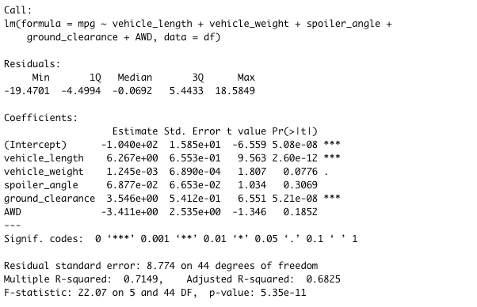
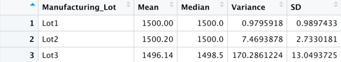
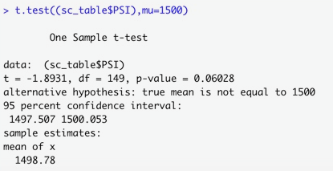
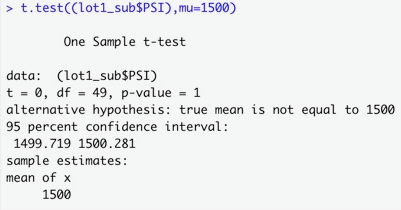
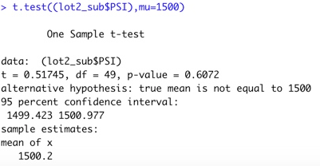
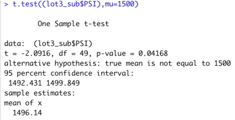

# MechaCar Statistical Analysis

This project seeks to provide data for a prototype car towards the goal of solving production issues and delays. Statistical Analysis packages in R were used to provide actionable insights into the issues present in production and manufacturing. 

## Linear Regression to Predict MPG

According to this linear regression model (**Figure 1**), ground clearance and vehicle length are statistically unlikely to add variance to the linear model. This is because the p-values for these two variables are quite small, which makes them statistically insignificant. This means that ground clearance and vehicle length are significantly impacting the prototype car's miles per gallon. The slope of this linear model is 0.7419, which indicates that about 74.2% if the data fits this model. This is determined by the multiple r squared, as shown in Figure 1. This linear model is 74.2% effective in showing predicting the miles per gallon of the protoype car, with emphasis on the relationship between miles per gallon and ground clearance and vehicle length.

### Figure 1

## Summary Statistics on Suspension Coils

The summary table in **Figure 2** shows that for all of the lots, the required variance of under 100 pounds PSI for the suspension coils is met. However, when viewing the variance by manufacturing lot (**Figure 3**), it is evident that lot 3 is above the required variance at about 170.29. This indicates that manufacturing lot 3 is the only lot where the variance is above the specifications needed to properly produce the suspension coils.

### Figure 2

### Figure 3

## T-Tests on Suspension Coils

The fist T-Test (**Figure 4**) was calculated for the PSI's from all 3 manufacturing lots, and was tested against the population mean of 1500 PSI. This t-test had a p-value of 0.06028. If we assume that we are using the typical p-value threshold of 0.05, then this data is above the required p-value. This means that we do not have sufficient evidence to reject the null hypothesis, and we can state that the two means are statistically similar.  The t-test from lot 1 (**Figure 5**) had a p-value of 1, and the mean of the PSI was exactly 1500. The t-test from lot 2 (**Figure 6**) had a p-value of 0.6072 and a mean of 1500.2, therefore the population and the sample are statistically similar. The t-test from lot 3 (**Figure 7**) had a p-value of 0.04168, which means that the two means are not statistically similar. This t-test aligns with our previous findings that lot 3 had problematic PSI's which indicates an error in their manufacturing.

### Figure 4

### Figure 5

### Figure 6

### Figure 7

